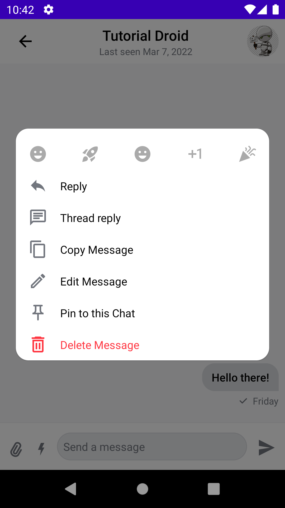
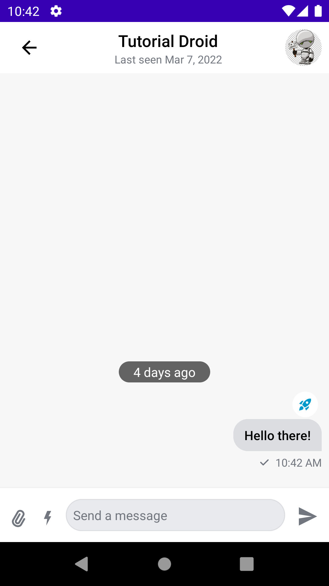
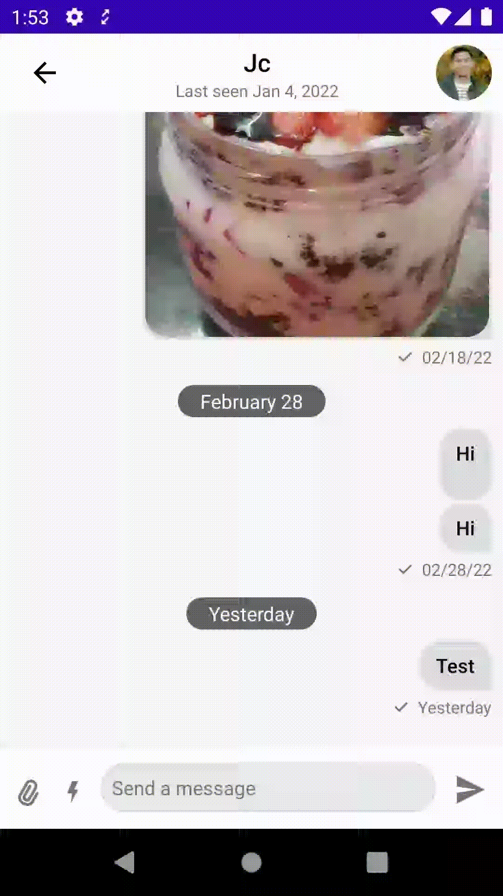
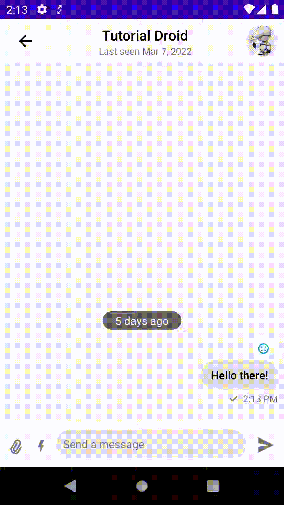

# Custom Reactions in Compose Chat SDK 

In this article, you'll learn how to add your custom reactions to Stream's Compose UI components. You'll use the [low-level Android client](https://github.com/GetStream/stream-chat-android/tree/main/stream-chat-android-client) library to send reactions.

With the new **SDK v5**, the ReactionsTypes API supports even more complex reactions. This version supports animated emojis or uploaded images just like other social media platforms. 

**Note**: The [Jetpack Compose UI components](https://getstream.io/blog/jetpack-compose-sdk/) are now stable. Check the full announcement [here](https://getstream.io/blog/android-v5-sdk-release/).  You can try out the new SDK in the [Jetpack Compose Chat Tutorial](https://getstream.io/chat/compose/tutorial/).

### Overriding Default Reactions

The Stream Chat SDK has the following reactions: thumbs up/down, love, LOL. Users can react to messages with either of these reactions. As with all the components in the Chat SDK, you can override these default reactions and provide your custom ones. There are two ways in which you can provide your custom reactions:

- Using the `reactionIconFactory` property in `ChatTheme`.
- Using the `reactionTypes` property in the `SelectedReactionsMenu` or `SelectedMessageMenu`.

First of all, you'll deep dive into the `ReactionIconFactory` class in the next section.

### Looking at `ReactionIconFactory`

The `ReactionIconFactory` is a newly introduced class. It handles all the creation of the icons for all the reactions types. You can create your custom `ReactionIconFactory` by implementing this class as shown below:

```kotlin
class CustomReactionIconFactory(
    private val customReactions: Map<String, ReactionDrawable> = mapOf(
        "happy" to ReactionDrawable(
            iconResId = R.drawable.ic_baseline_emoji_emotions_24,
            selectedIconResId = R.drawable.ic_selected_baseline_emoji_emotions_24
        ),
        "rocket" to ReactionDrawable(
            iconResId = R.drawable.ic_baseline_rocket_launch_24,
            selectedIconResId = R.drawable.ic_selected_baseline_rocket_launch_24
        ),
        "sad" to ReactionDrawable(
            iconResId = R.drawable.ic_baseline_emoji_emotions_24,
            selectedIconResId = R.drawable.ic_selected_baseline_sentiment_very_dissatisfied_24
        ),
        "plus_one" to ReactionDrawable(
            iconResId = R.drawable.ic_baseline_exposure_plus_1_24,
            selectedIconResId = R.drawable.ic_selected_baseline_exposure_plus_1_24
        ),
        "celebration" to ReactionDrawable(
            iconResId = R.drawable.ic_baseline_celebration_24,
            selectedIconResId = R.drawable.ic_selected_baseline_celebration_24
        )
    )
) : ReactionIconFactory {
    @Composable
    override fun createReactionIcon(type: String): ReactionIcon {
        val reactionDrawable = requireNotNull(customReactions[type])
        return ReactionIcon(
            painter = painterResource(reactionDrawable.iconResId),
            selectedPainter = painterResource(reactionDrawable.selectedIconResId)
        )
    }

    @Composable
    override fun createReactionIcons(): Map<String, ReactionIcon> {
        return customReactions.mapValues {
            createReactionIcon(it.key)
        }
    }

    override fun isReactionSupported(type: String): Boolean {
        return customReactions.containsKey(type)
    }
}
```

To sum up what the code above does:

- You have a map of your custom reactions. Each reaction has its `ReactionDrawable`, a data class that holds the drawable resources for the reaction. It has the drawables for both the normal and selected state of the icon.
- The `ReactionIconFactory` requires you to override three methods:
  - `createReactionIcon` - creates a `ReactionIcon` for your reaction types. A `ReactionIcon` contains painters for your reaction in normal and selected states.
  - `createReactionIcons` - creates all the `ReactionIcon`'s for alll your reactions. It uses the `createReactionIcon` to create the icons.
  - `isReactionSupported` - checks in your reactions are supported by the SDK.

With this `CustomReactionIconFactory` you're now ready to support custom reactions. You'll be adding this `CustomReactionIconFactory` to `ChatTheme` next.

### Providing Custom Reactions to ChatTheme

You'll use the `reactionIconFactory` property to provide your custom reactions to `ChatTheme`.  

```kotlin
ChatTheme(
    reactionIconFactory = CustomReactionIconFactory()
) {
    // Your UI Components
}
```

When you run your app, you should see:





In addition to using the `reactionIconFactory` in `ChatTheme` you can also provide your custom reactions using the `SelectedReactionsMenu` or  `SelectedMessageMenu` components. You'll be looking at that in the next section.

### Adding Custom Reactions to SelectedReactionsMenu and SelectedMessageMenu

To begin with, you need to create a map of `ReactionIcon` as follows:

```kotlin
@Composable
fun customReactionIcons(): Map<String, ReactionIcon> {
    return mapOf(
        "happy" to ReactionIcon(
            painter = painterResource(id = R.drawable.ic_baseline_emoji_emotions_24),
            selectedPainter = painterResource(id = R.drawable.ic_selected_baseline_emoji_emotions_24)
        ),
        "rocket" to ReactionIcon(
            painter = painterResource(id = R.drawable.ic_baseline_rocket_launch_24),
            selectedPainter = painterResource(id = R.drawable.ic_selected_baseline_rocket_launch_24),
        ),

        "sad" to ReactionIcon(
            painter = painterResource(id = R.drawable.ic_baseline_sentiment_very_dissatisfied_24),
            selectedPainter = painterResource(id = R.drawable.ic_selected_baseline_sentiment_very_dissatisfied_24)
        ),
        "plus_one" to ReactionIcon(
            painter = painterResource(id = R.drawable.ic_baseline_exposure_plus_1_24),
            selectedPainter = painterResource(id = R.drawable.ic_selected_baseline_exposure_plus_1_24)
        ),
        "celebration" to ReactionIcon(
            painter = painterResource(id = R.drawable.ic_baseline_celebration_24),
            selectedPainter = painterResource(id = R.drawable.ic_selected_baseline_celebration_24)
        )
    )
}

```

This is a `Composable` function that returns a map of your custom reactions. Each map has its type and a `ReactionIcon`. Now you only need to add these to your `SelectedReactionsMenu` or `SelectedMessageMenu` as follows:

```kotlin
SelectedMessageMenu(
    modifier = Modifier
        .align(Alignment.Center)
        .padding(horizontal = 20.dp)
        .wrapContentSize(),
    shape = ChatTheme.shapes.attachment,
    messageOptions = defaultMessageOptionsState(
        selectedMessage,
        user,
        listViewModel.isInThread
    ),
    message = selectedMessage,
    onMessageAction = { action ->
        composerViewModel.performMessageAction(action)
        listViewModel.performMessageAction(action)
    },
    reactionTypes = customReactionIcons(),
    onDismiss = { listViewModel.removeOverlay() },
    onShowMoreReactionsSelected = {},
)
```

In the code snippet above, you provide your custom reactions using the `reactionTypes` property in the  `SelectedMessageMenu`. The same applies to `SelectedMessageMenu`.

When you run the app, it will use your custom reactions even if you've not provided the custom `ReactionIconFactory`.

You've learned how to add your custom reactions. In the next section, you'll learn how to add spring and size animations to the reactions you've added.

### Adding Animations to Reactions

The Stream Jetpack Compose UI components are highly customizable. It's easy for you to add new components to them or customize the existing components according to your requirements. With this, it's easy to add animations to components and still take advantage of the SDK's features.

#### Adding Spring Animation

You're going to add spring animations to `DefaultReactionOptionItem` component so that your reaction icons can have the spring animations.


```kotlin
@Composable
internal fun DefaultReactionOptionItem(
    option: ReactionOptionItemState,
    onReactionOptionSelected: (ReactionOptionItemState) -> Unit,
) {
    var animationState by remember { mutableStateOf(ReactionState.START) }

    val springValue: Float by animateFloatAsState(
        if (animationState == ReactionState.START) 0f else 1f,
        spring(dampingRatio = 0.10f, stiffness = Spring.StiffnessLow)
    )

    LaunchedEffect(Unit) {
        animationState = ReactionState.END
    }

    CustomReactionOptionItem(
        option = option,
        springValue = springValue,
        onReactionOptionSelected = { onReactionOptionSelected(option) })
}
```

You're creating an animation value for the sping animation in the code above. You also have a `LaunchedEffect` block that updates the animation state. Here's what the `ReactionButtonState` looks like:

```kotlin
enum class ReactionButtonState {
    IDLE, ACTIVE
}
```

It's an enum class which holds state of the reaction icon.  Below the `LaunchedEffect` you have a `CustomReactionOptionItem` . This is a custom implementation for overriding the `DefaultReactionOptionItem`. This allows you to add the animations on top of the default implementations. This is how the class is:

````kotlin
@Composable
fun CustomReactionOptionItem(
    option: ReactionOptionItemState,
    springValue: Float,
    onReactionOptionSelected: (ReactionOptionItemState) -> Unit
) {
    // 1
    var currentState by remember { mutableStateOf(ReactionButtonState.IDLE) }
    val normalIconSize = 24.dp
    val animatedIconSize = 50.dp
    val sizeAnimation by animateDpAsState(
        if (currentState == ReactionButtonState.ACTIVE) 24.1.dp else 24.dp,
        animationSpec = keyframes {
            durationMillis = 500
            animatedIconSize.at(100)
            normalIconSize.at(200)
        },
        finishedListener = {
            onReactionOptionSelected(option)
        }
    )

    // 2
    Image(
        modifier = Modifier
            .size(size = sizeAnimation)
            .scale(springValue)
            .offset(x = (-15).dp + (15 * springValue).dp)
            .rotate(-45f + (45 * springValue))
            .clickable(
                interactionSource = remember { MutableInteractionSource() },
                indication = rememberRipple(bounded = false),
                onClick = {
                    currentState = if (currentState == ReactionButtonState.IDLE)
                        ReactionButtonState.ACTIVE else ReactionButtonState.IDLE
                    onReactionOptionSelected(option)
                }
            ),
        painter = option.painter,
        contentDescription = option.type,
    )
}

enum class ReactionButtonState {
    IDLE, ACTIVE
}
````

To sum up what happens:

- This creates the `ReactionIcon` size animation. The animation enlarges the reaction icon once a user taps on any of the reactions.
- Here, you create an `Image` composable for a single reaction. You also pass the spring animation to the `Modifier` . When the image is clicked, you also update the `ReactionButtonState`  for the size animation. The icon enlarges then once the animation is complete, you send your reaction to the message by calling ` onReactionOptionSelected(option)` inside the `finishedListener` of the animation.

#### Adding CustomReactionOptions to SelectedReactionsMenu

You already have all the custom implementation for reactions and animations. Now you'll learn how to integrate this custom implementation to `SelectedReactionsMenu`. 

To start with, you'll use the `headerContent` property of `SelectedMessageMenu` and `SelectedReactionsMenu` to add the custom UI implementations.

**Note:** to use these components, you need to have used the CustomUI options where you add the components to the **MesssageScreen**. You can view the entire sample class [here](https://github.com/wangerekaharun/StreamComposeAttachments/blob/main/app/src/main/java/io/getstream/streamcomposeattachments/activities/CustomMessageScreen.kt).

The `SelectedMessageMenu` , a component that shows different message options  when a message is selected, looks like this:

```kotlin
SelectedMessageMenu(
    modifier = Modifier
        .align(Alignment.Center)
        .padding(horizontal = 20.dp)
        .wrapContentSize(),
    shape = ChatTheme.shapes.attachment,
    messageOptions = defaultMessageOptionsState(
        selectedMessage,
        user,
        listViewModel.isInThread
    ),
    message = selectedMessage,
    onMessageAction = { action ->
        composerViewModel.performMessageAction(action)
        listViewModel.performMessageAction(action)
    },
    onDismiss = { listViewModel.removeOverlay() },
    onShowMoreReactionsSelected = {},
    headerContent = {
        CustomReactionOptions(
            message = selectedMessage,
            reactionTypes = customReactionIcons(),
            onMessageAction = { action ->
                composerViewModel.performMessageAction(action)
                listViewModel.performMessageAction(action)
            }
        )
    }
)
```

From the code above, you add your `CustomReactionOptions` component passing in the `selectedMessage` and your `customReactionIcons`  in the `headerContent`.  In addition, you also pass your actions so that the SDK can perform the message action. Running the app, you should have the spring animation on your reactions now.



Wow! You can now see the fantastic spring animations on your reactions! See how easy it is to customize the components :-)

Lastly, you'll look at the size animation on the reaction icon. The `SelectedReactionsMenu` , a component that shows all user reactions to a message, looks like this:

```       kotlin
SelectedReactionsMenu(
    modifier = Modifier
        .align(Alignment.Center)
        .padding(horizontal = 20.dp)
        .wrapContentSize(),
    shape = ChatTheme.shapes.attachment,
    message = selectedMessage,
    currentUser = user,
    reactionTypes = customReactionIcons(),
    onMessageAction = {},
    onDismiss = {
        listViewModel.removeOverlay()
    },
    onShowMoreReactionsSelected = {},
    headerContent = {
        CustomReactionOptions(
            message = selectedMessage,
            reactionTypes = customReactionIcons()
        ) { action ->
            composerViewModel.performMessageAction(action)
            listViewModel.performMessageAction(action)
        }
    }
)
```

From the code above, as before, you add your `CustomReactionOptions` component, passing in the `selectedMessage` and your `customReactionIcons`. Here, the only difference is that you use the [Stream low-level client](https://github.com/GetStream/stream-chat-android/tree/main/stream-chat-android-client/) to send reactions. Running the app, you should have the size animation when you tap a single reaction.



You can add as many animations to these UI Components according to your requirements. 

### Conclusion

To learn more about Stream's Android SDK, go to the [GitHub repository](https://github.com/GetStream/stream-chat-android), which is a great starting point to all the available docs and samples.

Now that the JetPack Compose Components are stable, we can't wait to see what you'll build. Furthermore, as seen from this article they're highly customizable. In case you have any feedback on using the SDK, reach the team [on Twitter](https://twitter.com/getstream_io) and [on GitHub](https://github.com/GetStream/stream-chat-android).

You can get the complete sample project with the examples shown in this tutorial [here]https://github.com/wangerekaharun/CustomComposeReactions).
